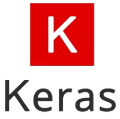
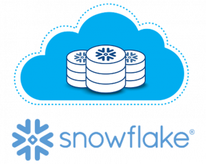

### Hi there, I'm Saqib Mumtaz👋
## I'm a Data Scientist, Machine learning Practitioner, AI Researcher   

*  🌱  I hold a Master's Degree in Data Science
  
*  🌱  I am a Google Certified TensorFlow Developer

- 👯 I am open to collaborating with others on projects related to Computer Vision, Deep Learning, NLP, Time Series Analysis, Audio Deep Learning, Satellite Image Segmentation.

- 🥅 My goals for 2023 include exploring more research in Computer Vision, Deep Learning, NLP, Time Series Analysis, Audio Deep Learning, Satellite Image Segmentation, and other related      fields
- 📫 Reach out to me on [LinkedIn](https://www.linkedin.com/in/thesaqibmumtaz/) or [Email](mailto:thesaqibmumtaz@gmail.com)

- ⚡ Fun fact: I have a passion for coding.

 ## ⚡  Technologies I use 

  

 

        <table align="center">
            <tr>
                <td align="center" width="140" height="112.43">
                    
                      Python
                </td>
                <td align="center" width="140" height="112.43">
                    
                      Jupyter
                </td>
                <td align="center" width="140" height="112.43">
                    
                      TensorFlow
                </td>
                <td align="center" width="140" height="112.43">
                    
                      PyTorch
                </td>
                <td align="center" width="140" height="112.43">
                    
                      Scikit Learn
                </td>
                <td align="center" width="140" height="112.43">
                    
                      Keras
                </td>
                <td align="center" width="140" height="112.43">
                    
                      Hugging Face
                </td>
                <td align="center" width="140" height="112.43">
                    
                      Snowflake
                </td>
                <td align="center" width="140" height="112.43">
                    
                      Streamlit
                </td>
                <td align="center" width="140" height="112.43">
                    
                      Gradio
                </td>
            </tr>
        </table>
    

     

---

***Thanks for visiting my profile.***
